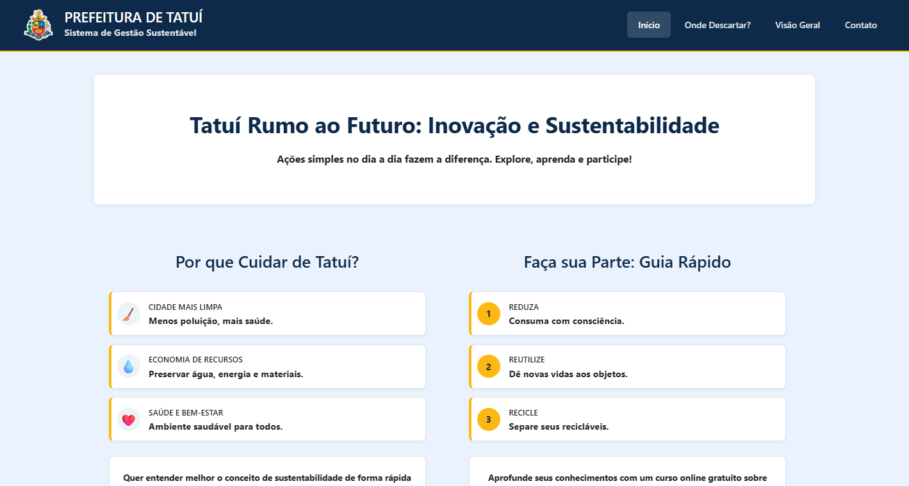
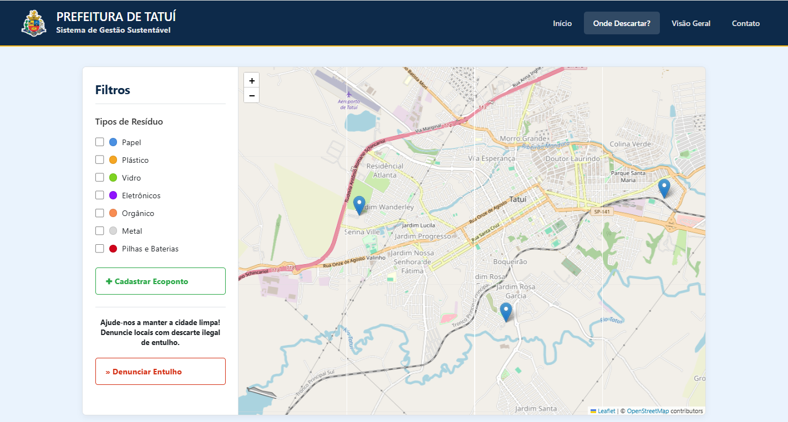
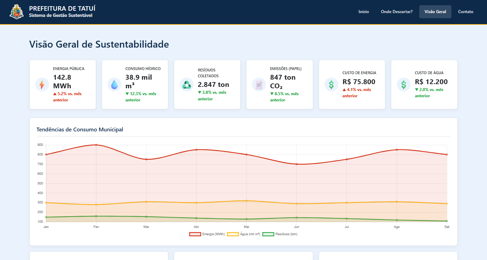

# Sistema de Gestão Sustentável - Tatuí

## Sobre o Projeto

O **Sistema de Gestão Sustentável** é uma plataforma desenvolvida para a cidade de Tatuí com o objetivo de promover a sustentabilidade e a conscientização ambiental entre os cidadãos e a gestão pública. O projeto foi criado durante o **Ideathon - Semana Tech 2025**.

A plataforma oferece ferramentas para que a população possa descartar resíduos de forma correta e para que a prefeitura monitore e gerencie o consumo de recursos, promovendo a transparência e a eficiência.

## Funcionalidades

O sistema é dividido em três seções principais:

### 1. Início

Página inicial que apresenta a importância da sustentabilidade e um guia rápido com os 3 Rs (Reduzir, Reutilizar e Reciclar). Também oferece links para materiais educativos, como vídeos e cursos online.

### 2. Onde Descartar?

Um mapa interativo que mostra os pontos de coleta de diferentes tipos de resíduos na cidade de Tatuí, como pilhas, eletrônicos, óleo, etc.

### 3. Visão Geral (Dashboard)

Um painel de controle para a gestão pública, com as seguintes funcionalidades:

*   **KPIs de Sustentabilidade:** Visualização de indicadores chave de desempenho, como consumo de energia, consumo hídrico, resíduos coletados, emissões de CO₂ e custos associados.
*   **Gráficos de Tendências:** Gráficos que mostram a evolução do consumo de recursos ao longo do tempo.
*   **Metas de Sustentabilidade:** Acompanhamento do progresso em relação às metas de sustentabilidade estabelecidas.
*   **Alertas do Sistema:** Notificações sobre anomalias, como consumo elevado em determinadas áreas, e alertas de manutenção.
*   **Análise Preditiva:** Previsões de consumo e recomendações para otimização de recursos.
*   **Ranking de Desempenho:** Tabela que classifica o desempenho de diferentes departamentos da prefeitura em relação ao consumo de recursos.

## Tecnologias Utilizadas

*   **Frontend:** HTML, CSS, JavaScript
*   **Bibliotecas:** Chart.js (para os gráficos do dashboard)

## Como Utilizar

Para utilizar a aplicação, basta abrir o arquivo `index.html` em seu navegador de preferência.

```bash
# Clone o repositório
git clone https://github.com/seu-usuario/Sistema-de-Gest-o-Sustent-vel---Tatu--main.git

# Navegue até o diretório do projeto
cd Sistema-de-Gest-o-Sustent-vel---Tatu--main

# Abra o arquivo index.html no navegador
```

## Telas do Projeto


**Página Inicial**


**Mapa de Descarte**


**Dashboard de Gestão**


## Desenvolvimento

Este projeto foi desenvolvido como parte do **Ideathon - Semana Tech 2025**, em colaboração com:

*   **Prefeitura de Tatuí**
*   **Fatec Tatuí**
*   **Point Media**

## Ideias para o Futuro

Para a evolução do projeto, algumas ideias que podem ser implementadas são:

*   **Integração com Banco de Dados:** Conectar o sistema ao banco de dados da prefeitura para obter dados mais precisos e em tempo real.
*   **Expansão para Outros Municípios:** Adaptar a plataforma para que possa ser utilizada por outras cidades.
*   **Painel Administrativo:** Criar uma área de administração para que a equipe da prefeitura possa gerenciar o conteúdo e os dados da plataforma.
*   **Formulário de Interação:** Adicionar um formulário para que o público possa enviar sugestões e interagir com a plataforma.
*   **Dados Locais:** Para o MVP, os dados podem ser armazenados localmente no navegador utilizando `localStorage`.

## Contribuição

Contribuições são bem-vindas! Se você tiver alguma ideia para melhorar o projeto, sinta-se à vontade para abrir uma *issue* ou enviar um *pull request*.

## Licença

Este projeto está sob a licença MIT. Veja o arquivo [LICENSE](LICENSE) para mais detalhes.
